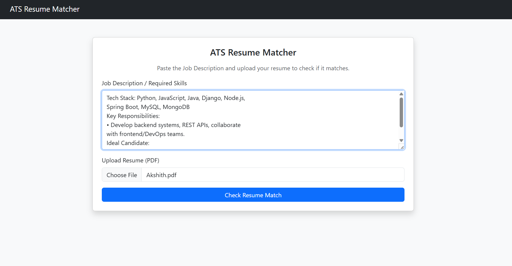
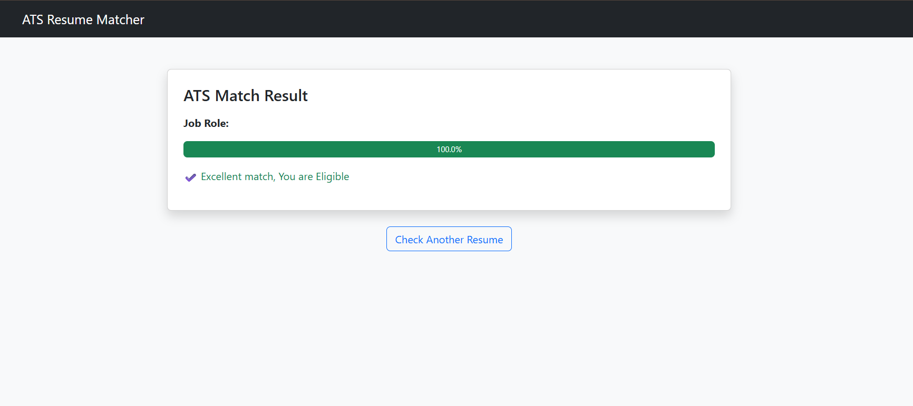
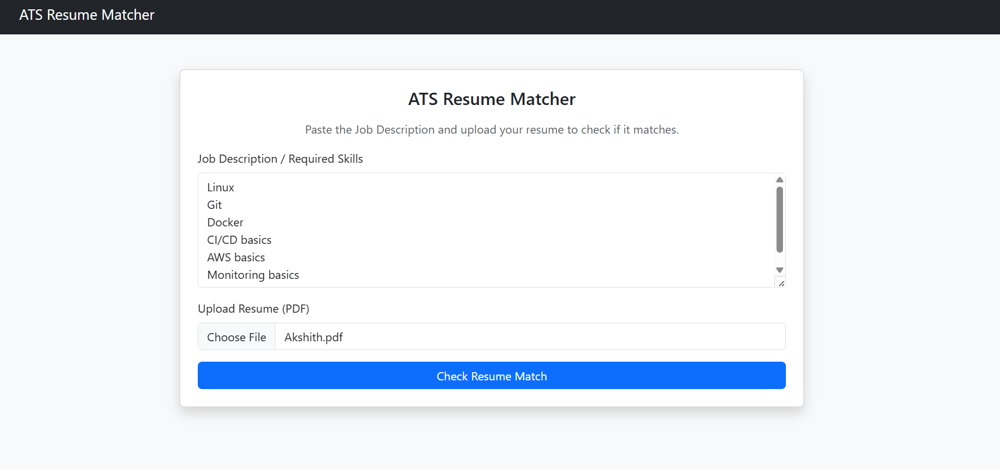
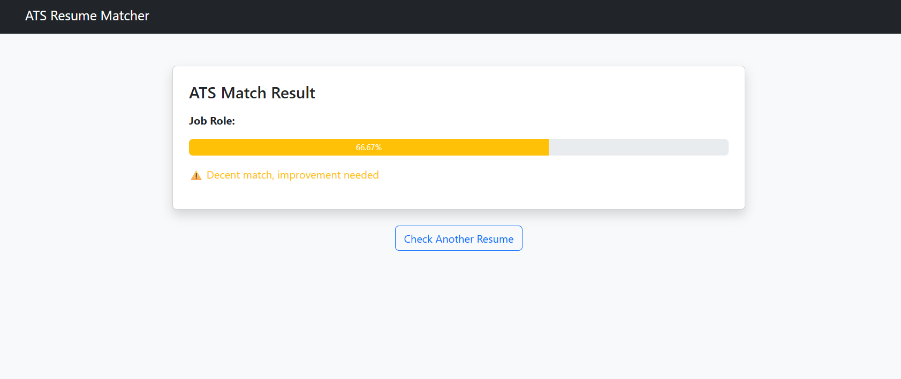

This is a sample ATS resume checker for the new jobs based on their Job Description

# ATS Resume Checker 🧠📄

A Django-based web application that checks whether a **resume is a good match for a given Job Description (JD)**, similar to how an **Applicant Tracking System (ATS)** works.

The user pastes a JD, uploads a resume (PDF), and the system evaluates whether the resume is suitable based on **skill matching**.

---

## 🚀 Features

- Upload resume in **PDF format**
- Paste **Job Description / Required Skills**
- Extract text from resume
- Match resume skills with JD skills
- Decide:
  - ✅ GOOD MATCH  
  - ❌ NOT A GOOD MATCH
- Show:
  - Matched skills
  - Missing skills
- Clean & user-friendly UI
- Ready for deployment with a public URL

---

## 📸 Screenshots








---

## 🛠️ Tech Stack

- **Backend:** Django (Python)
- **NLP:** NLTK
- **PDF Parsing:** PyPDF2
- **Skill Matching:** Keyword-based logic
- **Frontend:** HTML, Bootstrap
- **Version Control:** Git & GitHub
- **Deployment:** Render

---

## 📦 Installation

Requirements

- python ≥ 3.10
- pip
- git

---


## 📁 Project Structure

```text
ATS_Resume_Checker/
│
├── ats_project/
│   ├── settings.py
│   ├── urls.py
│   ├── wsgi.py
│   └── asgi.py
│
├── resumes/
│   ├── models.py
│   ├── views.py
│   ├── urls.py
│   └── admin.py
│
├── matcher/
│   └── services/
│       ├── pdf_parser.py
│       ├── text_cleaner.py
│       ├── skill_matcher.py
│       └── similarity.py
│
├── templates/
│   ├── base.html
│   ├── upload.html
│   └── result.html
│
├── build.sh
├── requirements.txt
├── .gitignore
├── README.md
└── manage.py
'''
